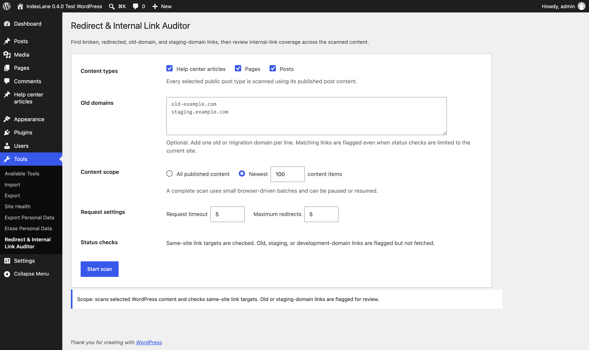

# IndexLane Broken Link & Redirect Auditor

Find broken internal links and migration leftovers, preview a repair, and check the result. Free, with no account required.

IndexLane runs inside WordPress admin and from WP-CLI. Use it after moving a site, changing page URLs, or taking over maintenance of an existing website. It checks selected stored WordPress sources, shows the page, menu, or template where each link is maintained, and can replace the stored link when you confirm the exact change.

[Install from WordPress.org](https://wordpress.org/plugins/indexlane-redirect-internal-link-auditor/) · [Project page](https://indexlane.dev/plugins/redirect-internal-link-auditor) · [Changelog](CHANGELOG.md)

Internal links can return **200 but still need attention**. Page intent shows canonical differences, noindex, meta refreshes, and missing fragment targets beside the HTTP evidence.

## When to use it

- **After a migration:** find links to old domains you supply and common staging or development domains. These off-site URLs are reported without being fetched.
- **After changing URLs:** find internal links that still take a redirect or end at a broken page, then fix them in place or open the source to update them.
- **During maintenance:** trace a broken link to its exact page, menu, pattern, template, or assigned block widget, acknowledge the ones you already know about, and let the scheduled check tell you when something new breaks.

The plugin never creates redirects, and scans and scheduled checks leave your content unchanged. A repair writes only the link values you reviewed and confirmed, keeps the previous stored values so it can be undone, and is limited to the exact URL inside link attributes and block link settings. It requires no account or IndexLane service. It reads stored sources; it does not crawl rendered pages or inspect unsupported page-builder data.

## Find it. Fix it. Prove it is fixed. Keep it clean.

| Step | What the plugin does |
| ---- | -------------------- |
| Find it | Scan selected stored sources and group broken, redirected, old-site, staging, and "200 but wrong" URLs with their exact editing locations. |
| Fix it | Replace one stored URL with another after previewing the exact before-and-after values. Sources the plugin must not touch are listed with a reason instead. |
| Prove it is fixed | Save a completed scan, then run a fix check against the same scope and read what is new, changed, resolved, or still present. |
| Keep it clean | Acknowledge known problems, undo recent repairs, and let the scheduled check email you only when the result changed. |

## Scan, fix, and check again

1. Open **Tools → Redirect & Internal Link Auditor**, choose the areas and content types to check, and select **Start scan**.
2. Keep the page open while the scan runs. You can pause and return later; if it reaches the request limit, increase the allowance to continue.
3. Review **Problem URLs** and the editing links under **Where it appears**. When several sources are affected, expand **View affected sources**. Use **Link details** for old-domain and staging links as well as the full scan evidence.
4. Under **Fix links**, enter the replacement URL, select **Preview changes**, check the exact stored and new values for every source, then apply the change. **Recent repairs** keeps the previous values so **Undo** can restore them.
5. Or select **Save these results for comparison** and fix the links in their WordPress editors as before.
6. Return to the auditor and select **Check fixes against saved scan**.
7. Review what is resolved or still present, then select **Download comparison** to keep the result or share it with a client.

[Follow the illustrated walkthrough](docs/quick-start.md) for a small demo site with a broken footer link and an outdated service URL.



## Preview the reports

These example CSVs use fictional site data and the current export columns:

- [Problem URLs](docs/sample-destination-impact.csv): grouped destinations and their editable sources.
- [Link details](docs/sample-report.csv): every occurrence, editing location, and HTTP result.
- [Content coverage](docs/sample-target-coverage.csv): incoming links from content and shared areas.

Completed scans also provide a comparison CSV after a fix check. Downloads reuse the displayed evidence without making another scan.

## WordPress-native link sources

Every source adapter can be selected independently:

- stored content from any selected public post type;
- every classic menu and its stored menu items;
- Navigation block entities;
- synced patterns and reusable blocks;
- effective block templates and template parts available to the Site Editor;
- block widgets currently assigned to widget areas.

Each occurrence retains the stable source identity, source surface, contextual or shared/global scope, edit URL, source URL where one exists, link text, and the full HTTP and redirect result. Shared structures are checked once where they are maintained, so a result can say that a broken URL exists once in a Footer template part instead of implying that hundreds of rendered pages each need editing.

The built-in adapters inspect stored structures only. They do not render blocks, execute shortcodes, search arbitrary metadata, or crawl frontend output.

## Complete scan sessions

- Choose all published content or a numeric limit of the newest content.
- Select any registered public post type when Content is enabled.
- Process work through authenticated WordPress AJAX in small browser-driven batches.
- See stored sources checked, links found, unique URLs checked, and links needing attention.
- Pause, continue, cancel, or reload and resume one per-administrator session.
- Deduplicate requests for the same URL across every selected source while retaining each occurrence.
- Stop at an explicit 250-request limit and increase that limit by 250 when needed.
- Download content-coverage, problem-URL, and link-detail CSVs only from exact completed scan results.

Each AJAX batch processes at most five stored sources and makes at most five actual outbound HTTP requests. Redirect chains persist between batches, so a request-limit boundary never creates a partial result row.

## Saved scans and fix checks

- Save one explicitly selected completed scan for comparison for the current administrator.
- Download or upload portable, versioned JSON scan data with strict format, file-size, completeness, counter, and site-URL validation.
- Import legacy schema-1 content-only saved scans without widening their scope.
- Import schema-2 saved scans written before destination-intent auditing as transport-only evidence.
- Rerun the saved source providers, post types, content scope, old domains, timeout, and redirect limit exactly.
- Bind each fix check to the saved scan revision used when it started.
- Classify URL issues as new, changed, resolved, or still present.
- Show saved-scan and latest-scan status chains, redirect counts, final URLs, page intent, outcomes, times linked, and editable sources affected.
- Download the completed comparison as CSV without making additional HTTP requests.
- Delete the saved scan explicitly without deleting the current temporary scan session.

The comparison is derived entirely from retained results. It never rescans during page rendering or download, and it refuses to compare when the saved scan or a required source provider changed after the fix check started.

## Repairing links in place

Under **Fix links**, every stored URL that needs attention gets one replacement field.

**Fix the suggested links in one reviewed batch.** When the scan already suggests a replacement for several URLs, select **Review suggested fixes** to see every from-and-to pair, keep or clear each suggestion, and apply the ones you keep as a single change. A source holding more than one suggested URL is folded into one write, and a single **Undo** restores the whole batch. The same batch is available from the command line with `wp indexlane fix-suggested`.

- IndexLane suggests the final URL when a redirect chain ends at a success status, and the permalink of published content when the evidence resolves to one. The suggestion is editable.
- **Preview changes** lists every affected source, its surface, and its exact previous and new stored value. Nothing is written during the preview.
- Applying the repair replaces only the exact URL. A site-relative stored link stays site-relative; an absolute one stays absolute; a link carrying `#fragment` is only matched when the stored fragment is identical.
- Visible text, headings, and unrelated markup are never rewritten, because only complete `href` and `src` attribute values and block `url` attributes are considered.
- Each repair records the previous stored values in a bounded journal so **Undo** can restore them.
- Undo re-reads each source first and skips any source that was edited after the repair, so a later manual edit is never silently discarded.

Repairs are deliberately limited to storage the plugin can edit safely and owns the write path for:

| Source | Repair support |
| ------ | -------------- |
| Published content, Navigation entities, synced patterns | Full support through `wp_update_post`. |
| Database-backed block templates and template parts | Full support through the stored template post. |
| Classic menu custom links | Full support through the stored menu item URL. |
| Classic menu items that follow a WordPress object | Reported with a reason; change the linked item in the menu editor. |
| Theme-file templates and template parts | Reported with a reason; edit the theme file. |
| Assigned block widgets | Full support through the stored widget option. |

Repairs are also refused, rather than silently truncated, when a single change would need more than 8 MB of encoded undo history or would edit more than 500 sources at once.

## Acknowledged problems

Mark a known problem as acknowledged and it stops counting as an attention item while staying in **Problem URLs**, the link details, and every CSV export. Acknowledging is bound to the URL *and* its outcome class, so a different outcome at that URL needs attention again; the original acknowledgement remains until restored. Acknowledged problems never trigger a scheduled-check email, and they never read as resolved.

## Scheduled checks

- Run the scope you save on an hourly, twice-daily, daily, or weekly schedule through WP-Cron.
- Send an initial summary after the first complete run, then email newly detected or resolved problems to the addresses you choose.
- Mark request-limited scans as partial. They do not replace the last complete comparison or report unseen issues as resolved.
- Resume across cron runs when a scan needs more than one bounded slice.
- Show the current state on the WordPress dashboard and in **Tools → Site Health**.

The scheduled check uses the same bounded scan engine and the same read-only evidence collection as a manual scan. It never edits content.

## WP-CLI

```sh
wp indexlane scan --content-scope=all --format=table
wp indexlane scan --source-types=content,menu --old-domains=old.example.com --format=json
wp indexlane fix --from=https://example.com/old/ --to=https://example.com/new/ --dry-run
wp indexlane fix --from=https://example.com/old/ --to=https://example.com/new/ --yes
wp indexlane fix-suggested --dry-run
wp indexlane fix-suggested --yes
wp indexlane repairs --format=table
wp indexlane undo --yes
```

`--dry-run` prints the exact sources and occurrence counts that would change without writing anything. `fix-suggested` reviews every suggested replacement as one batch; add `--from` to limit it to specific stored URLs. A real repair prints the batch ID and the command that undoes it.

## What it checks

- same-site links found in the selected stored sources;
- 404 and 410 targets;
- 301, 302, 303, 307, and 308 redirects;
- redirect chains, loops, and configured redirect limits;
- same-site redirects that leave the site, without fetching the external target;
- links pointing to old domains entered by the administrator;
- common staging or development-domain links;
- links that answer with `200` but still point somewhere else through a canonical or a meta refresh;
- links whose page is marked `noindex` in the response header or the robots meta tag;
- links whose stored fragment, such as `/pricing/#enterprise`, no longer exists on the page;
- links that use a different scheme than the site address, or a trailing slash that differs from the address WordPress serves for the content they point to;
- exact source, source surface, scope, edit URL, link text, status chain, redirect count, final URL, warning, page intent, and outcome.

Unrelated external links are skipped. Old, staging, and development-domain links are reported but never fetched.

## Destination intent

Transport evidence answers whether a URL responds. Destination intent answers whether the page it responds with is still the page the link promised. Each unique same-site destination is inspected once after its final response, and the derived evidence is reused for every occurrence, so no occurrence adds an outbound request.

The inspection records:

- the declared canonical, and whether it matches, differs, points to another site, or cannot be read;
- `noindex` and `nofollow` from the `X-Robots-Tag` header and the robots meta tag;
- a meta refresh target;
- the `id` and anchor `name` targets stored in the fetched page, used to confirm linked fragments;
- the response content type, so a PDF or image destination is reported as a file instead of a broken page;
- the scheme of a same-site link, so a stored `http://` link on an `https://` site is reported;
- whether a same-site link that resolves to published content is stored with the exact address WordPress serves, so a trailing-slash difference is reported;
- each occurrence's stored `rel` attribute, so an internal `nofollow` is reported conservatively.

Findings are classified separately from transport results. Intent only upgrades a healthy response: a different or off-site canonical, and `noindex`, move a `200` response to needs review; a meta refresh or a missing fragment moves it to warning; a file response, an inconclusive fragment, a page-level `nofollow`, and an internal `nofollow` are informational and never create an actionable issue. A destination that already redirects, is blocked, or is broken keeps the outcome its transport evidence produced — a `301` to a page whose canonical differs again stays a warning — and its page intent is reported beside that result.

The stable intent codes are `canonical_differs`, `canonical_offsite`, `canonical_unreadable`, `noindex`, `meta_refresh`, `fragment_missing`, `fragment_inconclusive`, `page_nofollow`, `internal_nofollow`, `file_response`, `scheme_mismatch`, and `permalink_mismatch`. A link scheme mismatch or a trailing-slash difference is only reported on a healthy, directly served response, and both offer a suggested replacement. Exports use those codes, and the human-readable wording is translated with the rest of the interface.

## Content link coverage

The completed coverage report contains one row per published content item included through the Content source. Each row includes:

- content title and URL;
- contextual incoming links;
- navigation/shared incoming links;
- total distinct editable sources linking to the target;
- outgoing internal links and distinct linked URLs from that content;
- link-text variants pointing to the content;
- self-link count;
- direct and redirected incoming-link counts;
- a conservative zero-, one-, or multiple-source status.

Open a content item's link details to review every exact source, source surface, contextual/shared scope, edit link, anchor, linked URL, status chain, and final URL. Filter the report to content with zero or one editable source, or download the complete content-coverage CSV.

When a selected source links through a redirect to a published WordPress URL, coverage counts the occurrence toward that final content item and retains the redirect results. The coverage report makes no additional HTTP requests.

“No incoming links detected in selected sources” is deliberately limited to the stored adapters chosen for that scan. It is not a claim about shortcode output, arbitrary metadata, page-builder storage, or rendered frontend pages.

## Problem URLs

One row is derived for each broken/error URL, redirected URL, and URL that returns `200` but still needs review. The primary view shows the URL, outcome, times linked, and exact editable sources affected. A single-source result links directly to that source and identifies its surface and scope; multi-source results expose the full list. HTTP status, redirect count, final URLs, warnings, and page intent remain available under technical details. The report never makes additional requests.

URL grouping normalizes scheme and host case, fragments, and default ports. Paths, query strings, schemes, non-default ports, and trailing slashes remain distinct because they can return different results.

## Source-provider API

Plugins can register reliable stored-source adapters through `indexlane_rila_source_providers`:

```php
add_filter(
	'indexlane_rila_source_providers',
	static function ( array $providers ): array {
		$providers['my_source'] = array(
			'label'             => __( 'My stored sources', 'my-plugin' ),
			'description'       => __( 'Links stored by My Plugin.', 'my-plugin' ),
			'context'           => 'shared',
			'default'           => false,
			'snapshot_callback' => 'my_plugin_snapshot_sources',
			'next_callback'     => 'my_plugin_next_source',
		);

		return $providers;
	}
);
```

The provider ID must be a stable lowercase identifier containing letters, numbers, underscores, or hyphens. The snapshot callback receives sanitized scan settings and returns an integer `total_items` plus a serializable array `cursor`. The next callback receives that cursor and the settings, then returns:

```php
array(
	'source' => array(
		'key'      => 'my_source:stable-id',
		'id'       => 123,
		'title'    => 'Footer links',
		'type'     => 'My shared footer',
		'context'  => 'shared',
		'url'      => '',
		'edit_url' => admin_url( 'admin.php?page=my-plugin' ),
		'base_url' => home_url( '/' ),
		'content'  => '<a href="/contact/">Contact</a>',
	),
	'cursor' => array( 'offset' => 1 ),
	'done'   => true,
);
```

`source` may be `null` when a snapshotted record disappeared. A source must have a globally stable `key` and either stored `content` or an exact `links` list containing `href` and `anchor` values, plus optional `rel` evidence. `context` is `contextual` or `shared`. A contextual provider may also supply `content_item` (`id`, `title`, `type`, `url`, and `edit_url`) when its records should become coverage targets. Callbacks should advance deterministically, keep cursors serializable, and inspect stored data without rendering or executing user content.

If a provider used by a paused scan disappears or returns an invalid contract, the scan stops with a recoverable message instead of silently producing incomplete evidence. A saved fix check likewise refuses to run if its provider is no longer registered.

## Data handling

One active or completed scan session per administrator is stored in a WordPress transient. Its sliding expiry is 24 hours, so abandoned sessions are cleaned up automatically by WordPress and completed results remain available briefly for download.

One opt-in, site-specific saved scan per administrator is stored in WordPress user options until explicitly replaced or deleted. Portable JSON supports longer-term storage outside WordPress without creating an in-plugin scan-history system.

The plugin creates no custom table, cron job, account, telemetry, frontend tracking, or content mutation.

All plugin-owned administrator, status, warning, result, JavaScript, and CSV-header strings use the `indexlane-redirect-internal-link-auditor` text domain. WordPress.org language packs can translate the plugin without bundled `.po` or `.mo` files.

## Limits

This is a stored-source link checker, not a rendered-site crawler. It does not execute shortcodes, inspect arbitrary metadata or proprietary page-builder storage, render templates, or crawl frontend pages. Third-party storage requires a provider registered by the plugin that owns and understands it.

HTTP checks use bounded GET response bodies, administrator-selected timeouts and redirect limits, WordPress unsafe-URL rejection, and manual same-site redirect handling.

Destination intent is judged from the fetched same-site response only. Two address checks are derived without an extra request: a stored link whose scheme differs from the site address, and a stored link whose trailing slash differs from the permalink that WordPress routing reports for the content it resolves to. Both are only reported on a healthy, directly served response. The plugin reads the response header, the head of the document, and up to 256 KB of the body, retains no response bodies, and keeps only derived evidence. A response that reaches that bound is treated as partial: fragment findings are then reported as inconclusive rather than missing, and up to 100 fragment targets are stored per page. Fragment-only links within their source page remain outside the scan. Page intent is inspected only on final successful same-site responses, including those reached after redirects. Transport outcomes remain dominant; no canonical target is fetched, and no soft-404, title, heading, schema, or score heuristic is applied.

One scan can snapshot at most 100,000 stored sources. Saved-scan uploads are limited to 20 MB, 100,000 content items, and 100,000 link-result rows. Uploaded data must use an exact supported format and belong to the current normalized site URL.

## CSV downloads

Content-coverage columns:

- Content
- Content URL
- Times Linked
- Contextual Links Here
- Navigation/Shared Links Here
- Editable Sources Linking Here
- Links From This Content
- Unique URLs Linked
- Link Text
- Self-Links
- Direct Links Here
- Redirected Links Here
- Outcome

Problem-URL columns:

- URL
- Problem
- Times Linked
- Editable Sources Affected
- Affected Source Details
- Source Edit URLs
- Outcome
- HTTP Status
- Maximum Redirects
- Final URLs
- Warnings
- Intent
- Intent Details

Link-detail columns:

- Source
- Source Surface
- Source Scope
- Source URL
- Edit URL
- Linked URL
- HTTP Status
- Redirects
- Final URL
- Warning
- Intent
- Intent Details
- Link Text
- Outcome

Comparison columns include the outcome, change, URL, changed fields, and explicit saved-scan/latest-scan values for each technical field, including the page-intent code of each side.

All downloads protect spreadsheet cells that could otherwise be interpreted as formulas.

## Result labels

- OK
- Warning
- Blocked
- Error
- Needs review

Labels are intentionally conservative. The plugin reports link results; it does not guess SEO impact.

## Development

Run the fast syntax and behavioral checks:

```bash
php -l indexlane-redirect-internal-link-auditor.php
php -l includes/trait-admin.php
php -l includes/trait-source-providers.php
php -l includes/trait-scan.php
php -l includes/trait-reports.php
php -l includes/trait-baselines.php
php -l includes/trait-fixes.php
php -l includes/trait-issues.php
php -l includes/trait-monitor.php
php -l includes/trait-cli.php
php -l includes/class-cli.php
php tests/behavioral.php
WP_CLI_BIN=/path/to/wp ./scripts/check-i18n.sh /tmp/indexlane-redirect-internal-link-auditor.pot
```

The translation check audits literal gettext calls and translator comments, then generates and validates a local POT without bundling translations. The CI workflow also installs WordPress, activates the plugin, runs the WordPress-loaded adapter/integration suite, and exercises the authenticated AJAX lifecycle, saved-scan save/upload/download/delete flow, exact-scope fix checks, comparison downloads, coverage filters, and detail views over HTTP.

[Publishing commands for 1.1.1](docs/publishing-1.1.1.md) cover Git, GitHub releases, and the existing WordPress.org SVN checkout. [Release notes for 1.1.1](docs/releases/1.1.1.md) describe the fixes; the [1.1.0 release notes](docs/releases/1.1.0.md) remain available.

Build the production ZIP for WordPress.org submission:

```bash
./scripts/build-wordpress-org-zip.sh
```

Release history is maintained in [CHANGELOG.md](CHANGELOG.md).
