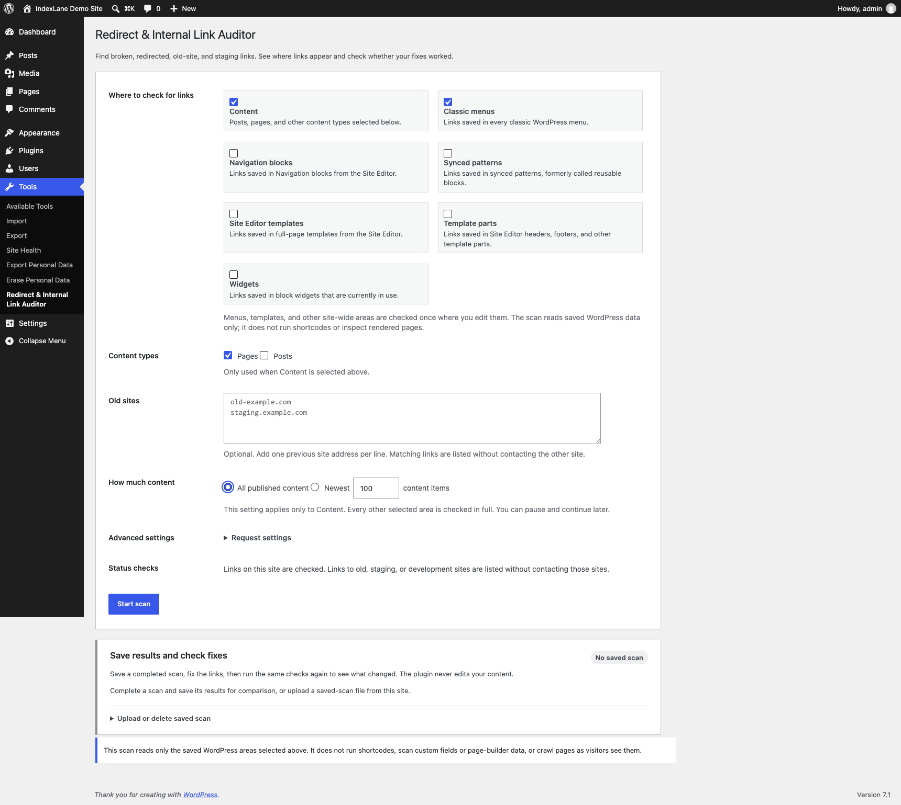
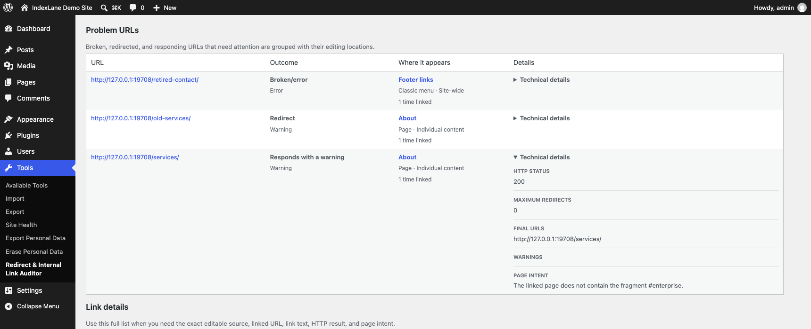
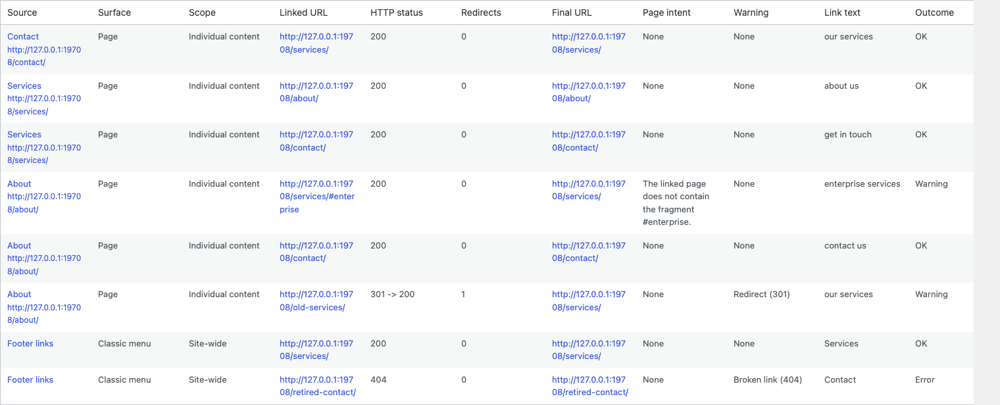
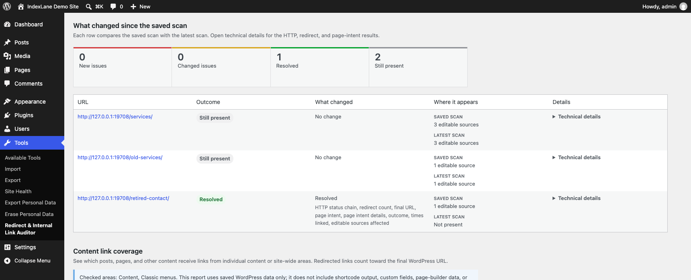

# Find a broken link, fix it, and check again

Use IndexLane after changing page URLs, moving a WordPress site, or taking over its maintenance. This walkthrough uses a small **demo site**, with fictional content and results from an actual plugin scan.

The demo has a **Footer links** menu pointing to a missing `/retired-contact/` page. Its **About** page also links to `/old-services/`, which redirects to `/services/`. A second About link points to `/services/#enterprise`, but that section is missing from the served page.

## 1. Scan the areas you maintain

Install and activate [IndexLane Redirect & Internal Link Auditor](https://wordpress.org/plugins/indexlane-redirect-internal-link-auditor/), then open **Tools → Redirect & Internal Link Auditor**.

Choose the WordPress areas and content types to check. The demo selects **Content**, **Classic menus**, and **Pages**, with all published content in scope. On your own site, also select any supported Navigation blocks, patterns, templates, template parts, or widgets you want included.

Select **Start scan** and keep the page open while it runs. You can pause and return later. If the request allowance is reached, use the option to increase it and continue until the scan is complete.

For a migration check, enter the old domains you want flagged. Links to those domains and common staging domains appear in **Link details**; the plugin does not fetch those off-site URLs.

## 2. Find the editing location

Scroll to **Problem URLs**. This groups broken, redirected, and responding destinations needing attention, shows how widely each appears, and links to the source under **Where it appears**. Expand **View affected sources** when more than one source is listed.

In the demo, `/retired-contact/` returns `404`, and its editing link opens the **Footer links** menu. `/old-services/` returns `301 → 200` and can be updated in **About**.

**Link details** contains the full occurrence list, including the original URL, link text, HTTP result, page intent, and editing location. A missing `#enterprise` target produces a warning even though `/services/` returns `200`.

**Content link coverage** shows detected incoming links from the selected sources. An empty incoming-link count describes this scan's coverage only.

## 3. Save the results before editing

Select **Save these results for comparison**. One saved scan is kept for your WordPress account. If one already exists, replace it only when you want this completed scan to become the new comparison point.

Unsaved results expire after 24 hours of inactivity. An explicitly saved scan remains until you replace or delete it; select **Download saved scan (.json)** if you need to keep another copy.

## 4. Edit the link in WordPress

Open the source's editing link. For this demo, expand the **Contact** item in **Footer links**, replace `/retired-contact/` with the URL of the published **Contact** page (`/contact/`), and save the menu.

These are your edits in WordPress. The auditor does not replace links or create redirects.

Leave the old service link in place for this example so the next scan can show both a resolved issue and one that still needs work.

## 5. Check the fixes

Return to the auditor and select **Check fixes against saved scan**. This uses the saved scope and replaces the current unsaved results with a new scan. Wait for it to finish.

Under **What changed since the saved scan**, the demo now shows:

- **Resolved:** the broken `/retired-contact/` link is no longer present in the scanned sources.
- **Still present:** the About page still links through `/old-services/` and to the missing `/services/#enterprise` section.
- **No new issues:** this scan did not find an additional issue in the selected scope.

Resolved means the issue is absent from the latest scan's evidence. In this example, the old contact URL was removed from the menu; it does not mean that the old URL itself now returns `200`. Open a row's **Technical details** to inspect the before-and-after evidence.

## 6. Download the evidence

Select **Download comparison** to keep the before-and-after CSV or share it with a client. The other downloads provide [problem URLs](sample-destination-impact.csv), [individual link details](sample-report.csv), and [content coverage](sample-target-coverage.csv). Those linked examples contain fictional site data.

Downloads use the displayed scan results without checking the links again.

## What this check covers

The plugin reads the stored WordPress sources you select. It does not execute shortcodes, inspect arbitrary custom fields or unsupported page-builder storage, or crawl pages as visitors see them. Same-site destinations receive HTTP checks; old-domain, staging, and external redirect destinations are reported without being fetched.

Use the result as evidence for that selected scope. A completed scan does not certify every rendered link on the site or validate an entire migration's redirect map.
